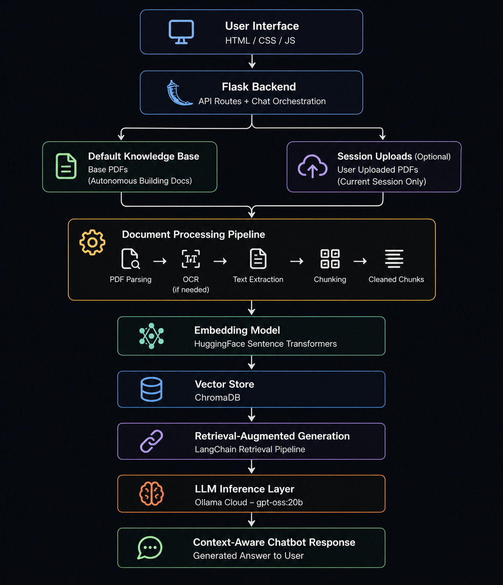

# Autonomous Building RAG Chatbot

A modular, AI-powered Retrieval-Augmented Generation (RAG) chatbot developed for the "Autonomous Building Project". It retrieves information from a pre-loaded knowledge base of PDF documents while allowing for dynamic, session-based PDF uploads.

## Architecture



## Features

- **RAG Architecture**: Provides grounded, context-aware answers to user queries, strictly adhering to hallucination-prevention rules.
- **Tech Stack**: Built using Python, FastAPI, LangChain, Cloud Qdrant, AWS Bedrock (Titan text embeddings v2), and Ollama (LLM).
- **Pre-loaded Knowledge**: Ingests default PDF documents for foundational knowledge base context.
- **Dynamic Uploads**: Allows dynamic, session-based PDF uploads for targeted document chat.
- **Modern UI**: Frontend interface designed for a seamless user experience.

## Getting Started

### Installation

1. Navigate to the project directory:
   ```bash
   cd ab-chatbot-v1
   ```

2. Create and activate a virtual environment:
   ```bash
   python -m venv venv
   # On Windows:
   venv\Scripts\activate
   # On macOS/Linux:
   source venv/bin/activate
   ```

3. Install the dependencies:
   ```bash
   pip install -r requirements.txt
   ```

4. Configure environment variables in the `.env` file, including AWS Bedrock credentials.

### Running the Application

Start the FastAPI application:

```bash
python app.py
```
Or run directly with uvicorn:
```bash
uvicorn app:app --reload
```

Then, navigate to the local URL (usually `http://127.0.0.1:8000/`) in your web browser. API documentation is automatically generated and accessible at `http://127.0.0.1:8000/docs`.
